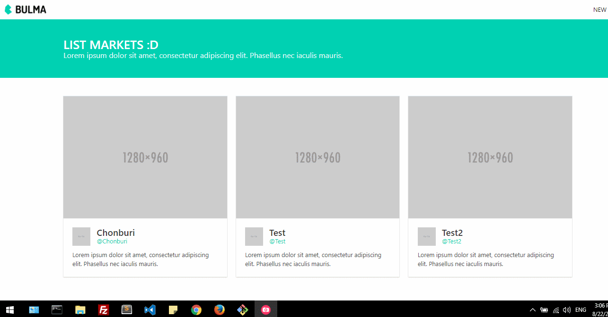

<p align="center">
</a>
</p>

# Laravel 5.4 Market
> CRUD List Markets With MySQL

### การติดตั้ง

#### 1. ติดตั้ง composer โดยใช้คำสั่ง
```composer install```

#### 2. ตั้งค่าไฟล์ .env ให้เรียบร้อย ซึ่งใช้ฐานข้อมูลเป็น MySQL แล้ว generate key โดยใช้คำสั่ง 
```php artisan key:generate```

#### 3. สร้าง Database ชื่อ `market`

#### 4. สร้าง Tables โดย Migration ใช้คำสั่ง
```php artisan migrate```

#### 5. สั่งรัน server ใช้คำสั่ง
```php artisan serve```
